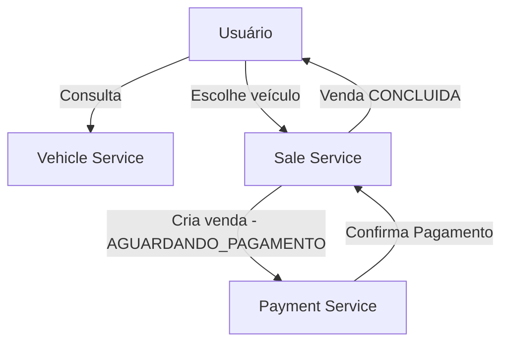

# Tech Challenge - Documentação de Fluxo Completo das Aplicações

Esta documentação apresenta o fluxo completo das aplicações desenvolvidas para o Tech Challenge, com o objetivo de oferecer uma visão clara e detalhada do funcionamento integrado dos microserviços.

## 🚀 Microserviços do Projeto

### 1. **Vehicle Service**
- Gerencia os veículos disponíveis.
- Operações:
    - Cadastro e atualização de veículos.
    - Consulta de veículos disponíveis.

### 2. **Sale Service**
- Responsável pelas vendas realizadas.
- Operações:
    - Criação de uma nova venda (status inicial: `AGUARDANDO_PAGAMENTO`).
    - Consulta de vendas realizadas.
    - Atualização do status das vendas (`CONCLUIDO` ou `CANCELADO`).

### 3. **Payment Service**
- Cuida dos processos relacionados ao pagamento.
- Operações:
    - Recebe solicitações de pagamento.
    - Simula confirmação de pagamento.
    - Atualiza status da venda no Sale Service.

## 🔄 Fluxo de Execução

### 1️⃣ Cadastro e Disponibilização de Veículos
- Usuário administra veículos através do **Vehicle Service**.
- Os veículos cadastrados ficam disponíveis para consulta dos usuários finais.

### 2️⃣ Realização de Venda
- O usuário seleciona um veículo disponível.
- Uma solicitação de venda é criada pelo **Sale Service** com status inicial `AGUARDANDO_PAGAMENTO`.

### 3️⃣ Processamento do Pagamento
- O **Payment Service** recebe a solicitação de pagamento referente à venda criada.
- O serviço processa e simula a confirmação do pagamento.
- Após a confirmação simulada, o **Payment Service** atualiza o status da venda no **Sale Service** para `CONCLUIDO`.

### 4️⃣ Finalização e Atualização
- O **Sale Service** disponibiliza o status atualizado para consulta.
- O usuário é notificado sobre a finalização do pagamento e conclusão da venda.

## 📌 Diagrama Resumido do Fluxo

## 🌐 Tecnologias Utilizadas
- Java 17, Spring Boot, Gradle
- PostgreSQL
- Docker, Kubernetes
- Clean Architecture
- Swagger (documentação da API)

## 📑 Documentação das APIs
Cada microserviço possui uma documentação Swagger própria, acessível em:
- Vehicle Service: `http://localhost:8081/swagger-ui.html`
- Sale Service: `http://localhost:8082/swagger-ui.html`
- Payment Service: `http://localhost:8083/swagger-ui.html`

---

Desenvolvido por Felipe 🚀

